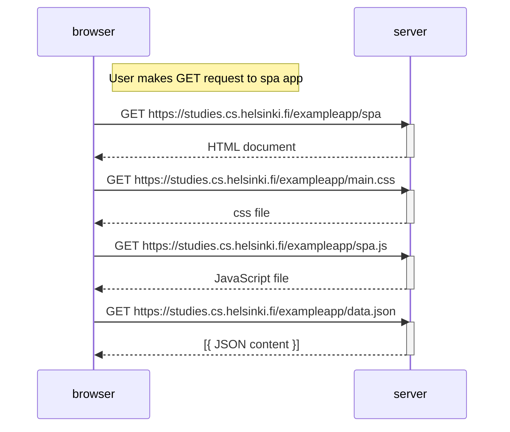

```mermaid
sequenceDiagram
    participant browser
    participant server

Note right of browser: User makes GET request to spa app
browser ->> server: GET https://studies.cs.helsinki.fi/exampleapp/spa
activate server
server -->> browser: HTML document
deactivate server

browser ->> server: GET https://studies.cs.helsinki.fi/exampleapp/main.css
activate server
server -->> browser: css file
deactivate server

browser ->> server: GET https://studies.cs.helsinki.fi/exampleapp/spa.js
activate server
server -->> browser: JavaScript file
deactivate server

browser ->> server: GET https://studies.cs.helsinki.fi/exampleapp/data.json
activate server
server -->> browser: [{ JSON content }]
deactivate server
```