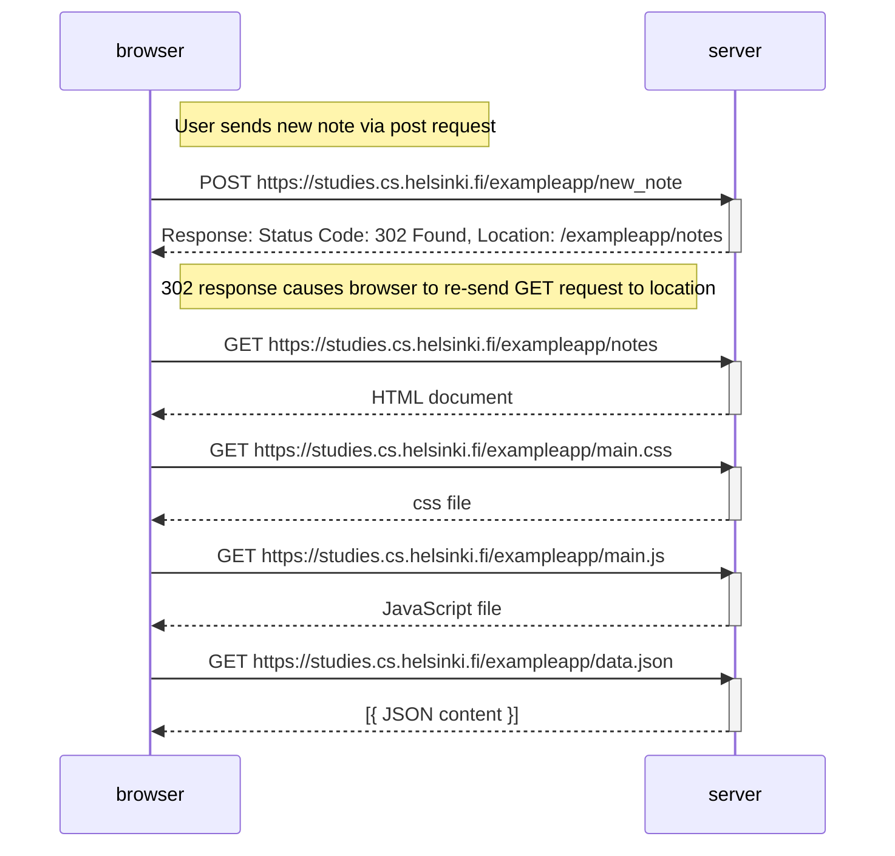

```mermaid
sequenceDiagram
    participant browser
    participant server

Note right of browser: User sends new note via post request
browser ->> server: POST https://studies.cs.helsinki.fi/exampleapp/new_note
activate server
server -->> browser: Response: Status Code: 302 Found, Location: /exampleapp/notes
deactivate server

Note right of browser: 302 response causes browser to re-send GET request to location
browser ->> server: GET https://studies.cs.helsinki.fi/exampleapp/notes
activate server
server -->> browser: HTML document
deactivate server

browser ->> server: GET https://studies.cs.helsinki.fi/exampleapp/main.css
activate server
server -->> browser: css file
deactivate server

browser ->> server: GET https://studies.cs.helsinki.fi/exampleapp/main.js
activate server
server -->> browser: JavaScript file
deactivate server

browser ->> server: GET https://studies.cs.helsinki.fi/exampleapp/data.json
activate server
server -->> browser: [{ JSON content }]
deactivate server
```