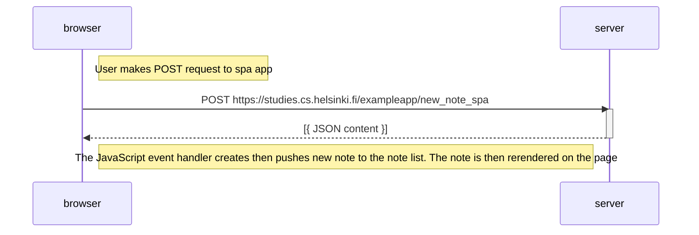

```mermaid
sequenceDiagram
    participant browser
    participant server

Note right of browser: User makes POST request to spa app
browser ->> server: POST https://studies.cs.helsinki.fi/exampleapp/new_note_spa
activate server
server -->> browser: [{ JSON content }]
deactivate server
Note left of server: The JavaScript event handler creates then pushes new note to the note list. The note is then rerendered on the page
```